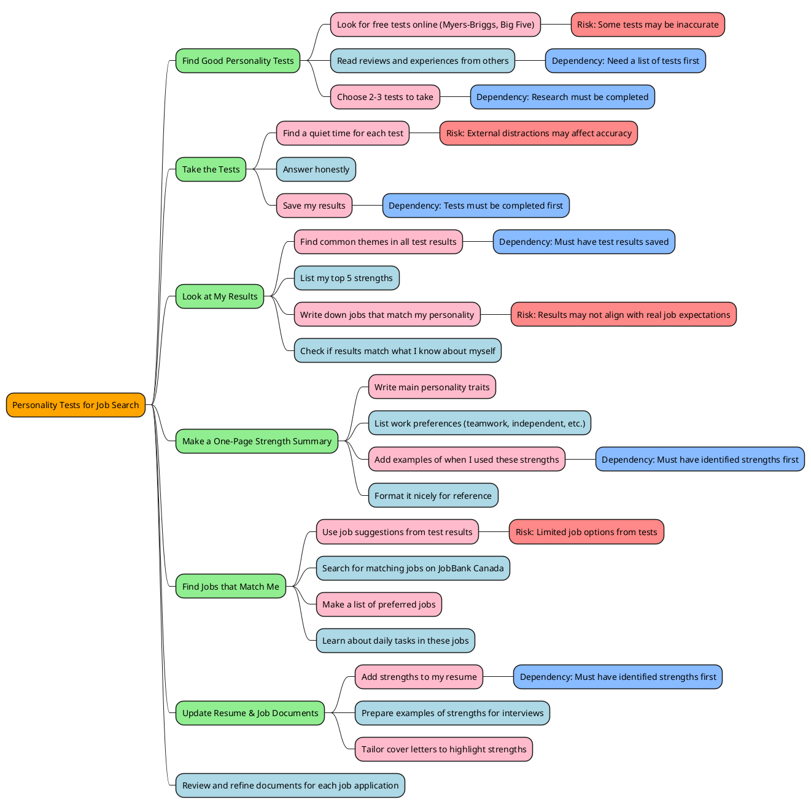
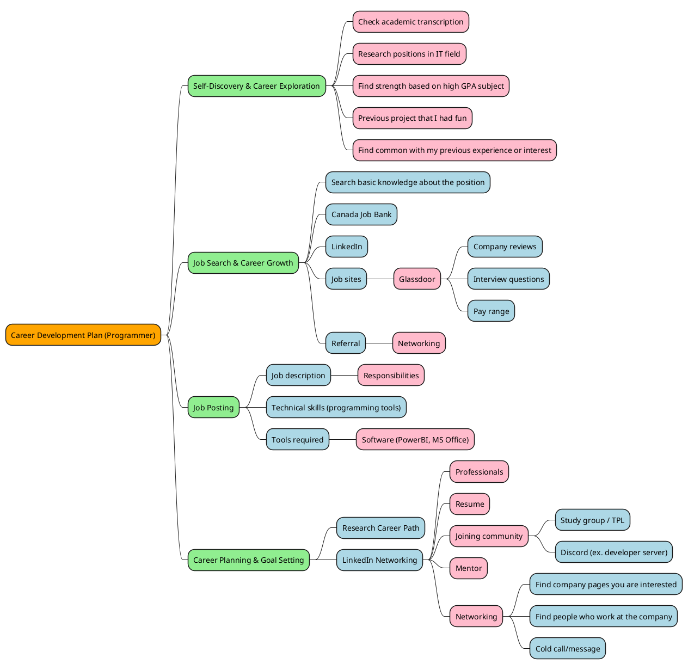
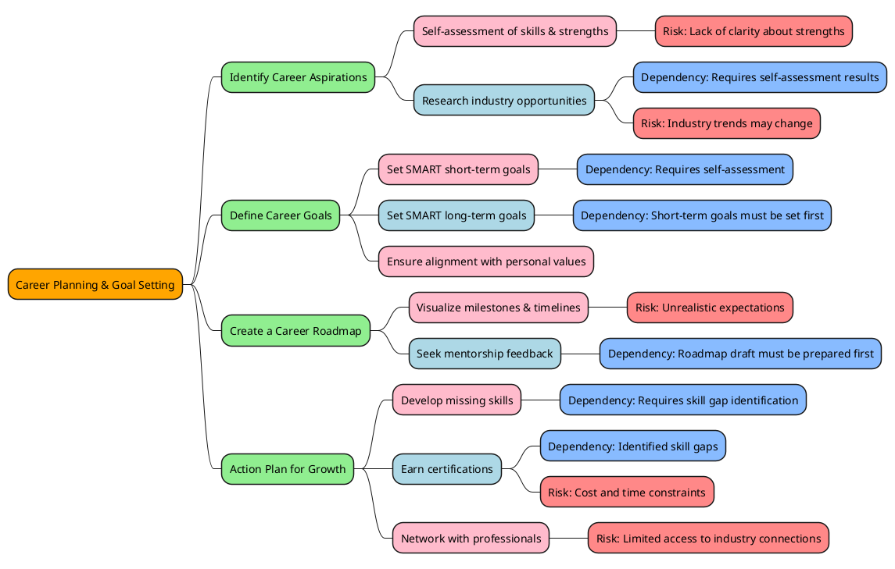
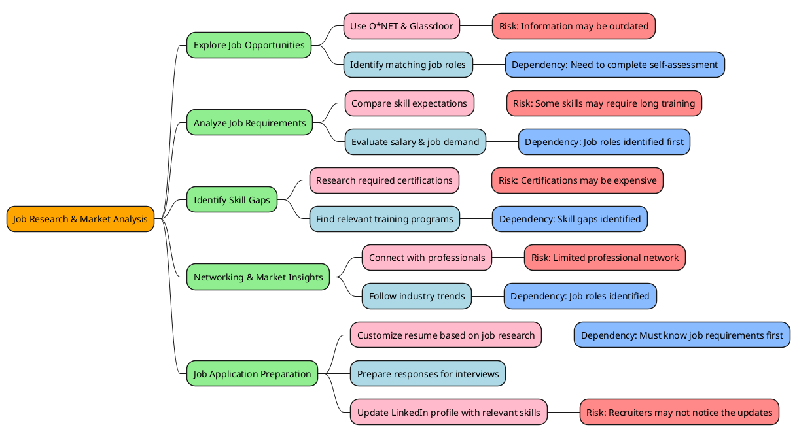

# PMC444 Assignment: Writing User Stories & Researching Career Development Tasks

## User Stories & Task Breakdown

### User Story #1
**As a job seeker, I want to take personality tests so that I can find jobs that match my strengths.**

#### Task Breakdown:
1. **Find good personality tests**  
   - Look for free tests online (Myers-Briggs, Big Five).  
   - Read what other people say about these tests.  
   - Choose 2-3 tests to take.  

2. **Take the tests**  
   - Find a quiet time to do each test.  
   - Answer honestly.  
   - Save my results.  

3. **Look at my results**  
   - Find common things in all test results.  
   - List my top 5 strengths.  
   - Write down jobs that fit my personality.  
   - Check if results match what I know about myself.  

4. **Make a one-page strength summary**  
   - Write my main personality traits.  
   - List how I like to work (in teams or alone, etc.).  
   - Add times when I've used these strengths before.  
   - Make it look nice.  

5. **Find jobs that match me**  
   - Use job ideas from the test results.  
   - Look up jobs on JobBank Canada website.  
   - Make a list of jobs I like that match my personality.  
   - Learn what these jobs are like day-to-day in Toronto.  

6. **Update my resume and job papers**  
   - Add my strengths to my resume.  
   - Prepare stories about my strengths for job talks.  
   - Change cover letters to show strengths that fit each job.  

#### Mind Map
![Diagrama](https://kroki.io/plantuml/svg/eNq1Vktv2zAMvvdXEBgwtEO7w4YBxU5t0mVY0axF02KHIQfGpm0tluRJdFL_-1Gy83KSrZfllkAivxepXHlGx1qZVGN18u7nm3uHJqcpPJDz1mCpuIEn8uwhsw5u7QwmhC4pTgDkdKnygnNHZKYwkiLw1dp0_64cjsdHo8FgOJzCnbXzWC-Tq8CxvDWlMgSn40ZuXwycynN_DgOVS-EFncUSXZFL-UzhUfn5Z5hYvaqgsYEZgTKYJLVDplXbiHJW1kLrkTAFRwtFSw8ogOmlIqfIJCQMndVguRAAm3aXl4PBaDSFG6rIpHKw-QzfiVJAKJVnsFnXPlPOc5_psLDWE3y4-NidYguMc_p7_UfyUWTQtXQQTonVVUlM6b7sT1INBPNhpaMpCL9rRQysRKsgO6HUDniOqfrlhcmJg5AKRYcJK2tagTHLKGFoJU6aAxJfG78kB4U10qBs-ogmuCDQjZjg65L_IXSbvD0V1lr3tIi5QoZxEyRcl-_rIXW0NUE0La4rA1iWUY7XgRoHOEWgsX0HvPySHtDjLqRECLOt4BOInGRyLvaQ_XCKCVK7NPDLziQohRDRyCEFDVSbkTrmWcc4umSsWCQYDCwVFwJRrJSqMe0JY7TzANRhQckcVLbm1PZfBijfYG7sEnBm60DHU5ntGzAOYUS4N3TxgDnBpGMLk1prdM1h0hrFgy2GIJFT7I9pubRuDpWjjFw7t6dMqMOv52Jm2jnF50CcvD_rt7xOw9BjSJIPw7ssyAi52kusJBEyrLsWvSIGKrRTmZIK67u762CLwsg6URUUg1EJlU0cyDWZI2v1dp2IcXRkTH1azwI8OOzrPJdUxnmN--xwrnejc6e0CmMVCtiqd_mQD-0bEKHHiCiTt6mVsRKsAzRzGKLBFPs4u4SsVmdro2t7H3RcOpkudSkq0YvRz-PUtm5193qqPVepPABxJmTnvY0P141N5IvZXwohEhvjZEN360nTf0nAg6MKHe2kcOuWaKqMrN_4RvWhPokEciCxC1mxsgvlXERcSPnYYie9_bcvlIyvnqgeHtt0pcjmVQgRwKoqVRK3xMmVsO3-HvwBg7-w7A==)
---

### User Story #2
**As a computer programming student, I want to make a Career Development Plan so that I have a clear path for my future career path.**

#### Task Breakdown:
1. **Identify key skills, certifications, and career paths based on professional programmers' experiences.**  
   - Research different programming roles (e.g., front-end, back-end, full-stack).  
   - Analyze job postings to identify required skills and certifications.  
   - Review LinkedIn profiles & resumes of professionals in target roles.  
   - Identify their skills, certifications, and career progression.  

2. **Determine essential skills and learning resources.**  
   - List programming languages, tools, and certifications relevant to the position.  
   - Compare learning options: university, bootcamps, online courses.  

3. **Set structured career milestones.**  
   - Short-term (6 months – 1 year): Learn core programming, earn a basic certification, build projects.  
   - Long-term (2– 5 years): Gain work experience, earn advanced certifications, specialize in a field.  

4. **Create an Actionable Plan (Step-by-Step).**  
   - Set SMART (Specific, Measurable, Achievable, Relevant, Time-bound) goals.  
   - Break goals into weekly/monthly learning schedules.  
   - Find study partners or mentors for accountability by joining communities (GitHub, Discord coding groups, LinkedIn connections).  

5. **Track Progress & Adjust as Needed.**  
   - Track completed courses, certifications, and projects.  
   - Maintain a progress journal or use tools like Notion, Trello, or Excel.  
   - Regularly update GitHub with completed projects and contributions.  
   - Reflect & reassess goals every 6 months.  
   - Stay adaptable to industry trends (AI, Web3, DevOps).  
  
#### Mind Map

   

#### Research & Resources:
- [Career Centre Ontario Resources](https://www.ontario.ca/page/employment-ontario) – Free career planning help in Ontario, including guides and templates.
- [Toronto Next Steps Employment Centre](https://www.next-steps.ca/job-seekers/career-planning/) – Offers workshops, career plans, and employment assistance.
- [LinkedIn Learning via Toronto Public Library](https://www.torontopubliclibrary.ca/detail.jsp?R=EDB0187) – Free career planning courses with a Toronto library card.
- [PMI Toronto Chapter Resources](https://pmitoronto.ca/index.php/professional-development) – Local project management resources, networking, and career development tools.

---
### User Story #3
**As a career planner, I want to define my short-term and long-term goals so that I can create a clear roadmap for my professional development.**

#### Task Breakdown:
1. **Identify career interests and aspirations.**  
   - Reflect on personal strengths, interests, and values.  
   - Explore industries that align with these interests.  
   - Research job roles within selected industries.  

2. **Assess current skills and areas for improvement.**  
   - List existing skills and qualifications.  
   - Identify skill gaps based on industry expectations.  
   - Seek feedback from mentors or career counselors.  

3. **Define SMART career goals.**  
   - Set short-term (6 months - 1 year) goals (e.g., acquire a certification, build a portfolio).  
   - Set long-term (2-5 years) goals (e.g., gain work experience, specialize in a field).  
   - Break down each goal into achievable steps.  

4. **Create a visual roadmap.**  
   - Use tools like Notion, Trello, or MindMeister.  
   - Define career milestones with estimated timelines.  
   - Include checkpoints for reassessment and flexibility.  

5. **Develop an action plan.**  
   - Identify required courses, certifications, and resources.  
   - Connect with professionals for mentorship.  
   - Build a schedule to stay accountable.  

6. **Track progress and adjust plans.**  
   - Maintain a progress journal.  
   - Regularly reassess goals based on industry changes.  
   - Stay adaptable to emerging trends.  

#### Mind Map

#### Research & Resources:
- [MindTools - SMART Goal Setting Guide](https://www.mindtools.com/) – Guide for defining clear career goals.
- [Coursera - Career Development Courses](https://www.coursera.org/) – Online courses on career planning and professional growth.
- [Harvard Business Review - Career Planning](https://hbr.org/) – Insights on setting and achieving career goals.
- ["What Color is Your Parachute?" by Richard N. Bolles](https://www.amazon.com/) – A career development book with exercises to define career paths.

---

### User Story #4
**As a job seeker, I want to research ideal jobs using resources like O*NET so that I can identify roles that match my skills and interests.**

#### Task Breakdown:
1. **Explore job opportunities.**  
   - Search O*NET and Glassdoor for potential job roles.  
   - Compare job descriptions, salary expectations, and market demand.  
   - Shortlist job titles that align with personal interests.  

2. **Analyze job requirements.**  
   - Identify required skills, education, and experience levels.  
   - Compare these requirements with current skillset.  
   - List certifications or additional training needed.  

3. **Identify skill gaps.**  
   - Research industry expectations for selected job roles.  
   - Find training programs, bootcamps, or courses to bridge gaps.  
   - Enroll in relevant certifications or upskilling programs.  

4. **Network with professionals.**  
   - Connect with professionals on LinkedIn.  
   - Join industry forums or career mentorship programs.  
   - Seek informational interviews for real-world insights.  

5. **Refine job search strategy.**  
   - Document findings and update career goals.  
   - Adjust job applications based on insights gained.  
   - Prepare for interviews with industry-specific knowledge.  

#### Mind Map

#### Research & Resources:
- [O*NET Online](https://www.onetonline.org/) – Comprehensive database of job roles and required skills.
- [Glassdoor](https://www.glassdoor.com/) – Job reviews, salary insights, and job market trends.
- [Bureau of Labor Statistics (BLS)](https://www.bls.gov/) – Job growth projections and industry statistics.
- [LinkedIn Learning](https://www.linkedin.com/learning/) – Courses on job searching, networking, and career transitions.

#### Map 1

#### Map 2

#### Map 3

#### Map 4

